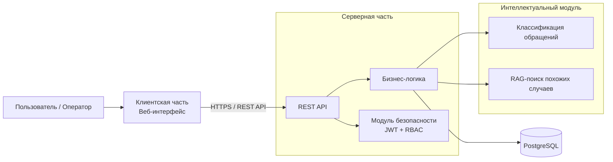

# ER-диаграмма

```mermaid
flowchart LR

    U[Пользователь / Оператор]

    FE[Клиентская часть<br/>Веб-интерфейс]

    subgraph BE[Серверная часть]
        API[REST API]
        BL[Бизнес-логика]
        SEC[Модуль безопасности<br/>JWT + RBAC]
    end

    DB[(PostgreSQL)]

    subgraph AI[Интеллектуальный модуль]
        CLS[Классификация обращений]
        RAG[RAG-поиск похожих случаев]
    end

    U --> FE
    FE -->|HTTPS / REST API| API

    API --> BL
    API --> SEC

    BL --> DB
    BL --> CLS
    BL --> RAG
```
