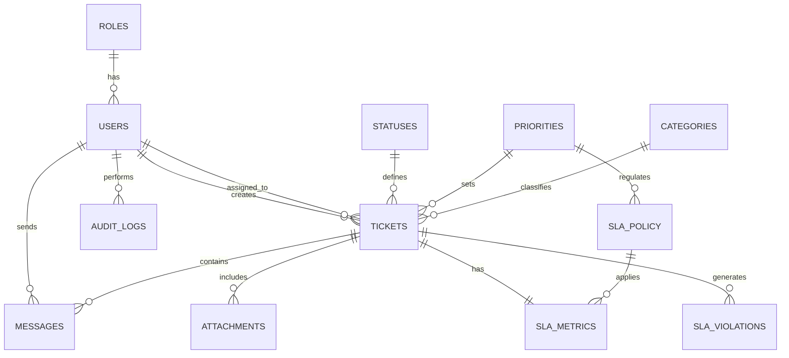

# ER-диаграмма

```mermaid
erDiagram

  ROLES ||--o{ USERS : has
  USERS ||--o{ TICKETS : creates
  USERS ||--o{ TICKETS : assigned_to
  USERS ||--o{ MESSAGES : sends
  USERS ||--o{ AUDIT_LOGS : performs

  STATUSES ||--o{ TICKETS : defines
  PRIORITIES ||--o{ TICKETS : sets
  CATEGORIES ||--o{ TICKETS : classifies

  TICKETS ||--o{ MESSAGES : contains
  TICKETS ||--o{ ATTACHMENTS : includes
  TICKETS ||--|| SLA_METRICS : has
  TICKETS ||--o{ SLA_VIOLATIONS : generates

  PRIORITIES ||--o{ SLA_POLICY : regulates
  SLA_POLICY ||--o{ SLA_METRICS : applies

```

Нормализация до 3НФ соблюдена: пользовательские данные, категории и сообщения вынесены в отдельные сущности.
