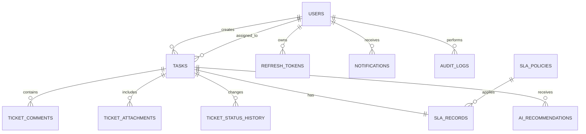

# База данных

База данных построена на PostgreSQL и описывает систему обработки заявок, пользователей, SLA, уведомлений, аудита и AI/RAG-рекомендаций.

Актуальная ER-схема с первичными ключами (`PK`), внешними ключами (`FK`), уникальными ограничениями (`UQ`), индексами (`IDX`) и всеми полями таблиц вынесена в отдельный документ: [`docs/ER.md`](ER.md).

## Основные сущности

- `users` — пользователи системы и их роли.
- `tasks` — заявки/инциденты, созданные пользователями и назначенные исполнителям.
- `ticket_comments`, `ticket_attachments`, `ticket_status_history` — комментарии, вложения и история статусов заявок.
- `sla_policies`, `sla_records` — политики и фактические метрики SLA.
- `knowledge_base_articles`, `vector_records`, `ai_recommendations` — база знаний, векторный индекс и рекомендации ИИ.
- `refresh_tokens`, `notifications`, `audit_logs` — авторизация, уведомления и журнал аудита.

## Ключевые связи

Нормализация поддерживается разделением пользовательских данных, заявок, комментариев, вложений, SLA-метрик, уведомлений, аудита и AI/RAG-данных по отдельным сущностям.
