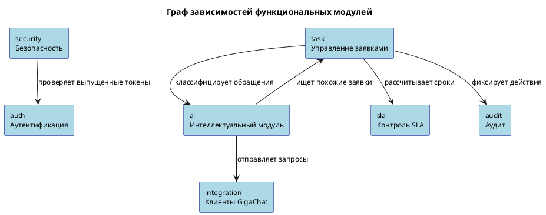

# UML (PlantUML)

```plantuml
@startuml
skinparam rectangleBackgroundColor LightBlue
skinparam rectangleBorderColor DarkBlue
skinparam defaultFontSize 12

title Граф зависимостей функциональных модулей

rectangle "auth\nАутентификация" as auth
rectangle "security\nБезопасность" as sec
rectangle "task\nУправление заявками" as task
rectangle "ai\nИнтеллектуальный модуль" as ai
rectangle "integration\nКлиенты GigaChat" as integ
rectangle "sla\nКонтроль SLA" as sla
rectangle "audit\nАудит" as audit

sec --> auth : "проверяет выпущенные токены"
task --> ai : "классифицирует обращения"
task --> audit : "фиксирует действия"
task --> sla : "рассчитывает сроки"
ai --> integ : "отправляет запросы"
ai --> task : "ищет похожие заявки"
@enduml
```
